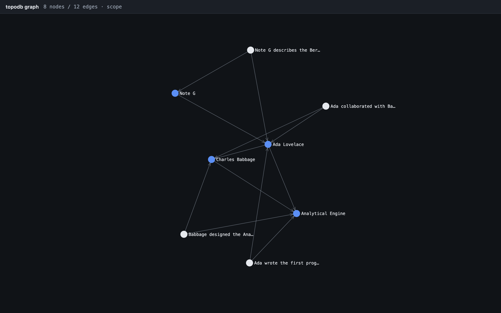

# TopoDB

[](https://crates.io/crates/topodb)
[](https://docs.rs/topodb)

TopoDB is an embedded memory engine for AI agents, written in Rust.
It runs in-process, and there is no server.
Facts are stored on a temporal property graph and supersede rather than
overwrite.
Recall is scoped, and search uses BM25 and graph-scoped vectors.
A change feed supports work outside the engine.

Status is 0.1, with breaking changes reserved for 0.2.0; however, the
on-disk format migrates in place.



`topodb graph --graph-format html --out graph.html` writes a self-contained
viewer.

## Principles

1. Narrow and deep — one workload done excellently
2. Format stability is a feature — versioned on-disk format, migrations always
3. Honest benchmarks from day one
4. Engine, not policy — no LLM calls inside the database, ever
5. Embedded-first — servers and sync are future layers, never prerequisites

## Install

```bash
cargo install topodb-cli          # binary name: topodb
topodb --db agent.redb remember --content "ada wrote the first program" --entity ada
topodb --db agent.redb search "first program"
```

The CLI opens the file in-process. A second process holding the same file
will fail.

| Client | Install |
|---|---|
| Claude Code | `/plugin marketplace add TopoDB/TopoDB` then `/plugin install topodb` |
| Cursor | Import `https://github.com/TopoDB/TopoDB` (`plugins/cursor`) |
| Pi | `pi install npm:@topodb/pi` |
| Any MCP client | `cargo install topodb-mcp` — [`docs/agent-clients.md`](docs/agent-clients.md) |
| Rust | [`crates/topodb`](crates/topodb/README.md) |

Scope ids are keyed to the absolute project path.
They do not follow a repo across clones or machines.
[`plugins/claude-code/README.md`](plugins/claude-code/README.md) ·
[`crates/topodb-cli`](crates/topodb-cli/README.md) ·
[`crates/topodb-mcp`](crates/topodb-mcp/README.md) ·
[FORMAT.md](FORMAT.md) ·
[topodb.dev](https://topodb.dev)

## Benchmarks

[LongMemEval-S](https://github.com/xiaowu0162/LongMemEval), 500 questions.
The embedder is held constant, so the figure is ranking.
Hybrid Recall@5 is **0.987** at turn granularity.

| Leg | R@1 | R@3 | R@5 | R@10 |
|-----|-----|-----|-----|------|
| text (BM25)     | 0.872 | 0.932 | 0.953 | 0.979 |
| vector          | 0.864 | 0.953 | 0.977 | 0.989 |
| hybrid (RRF)    | 0.894 | 0.966 | 0.987 | 0.996 |

Per-turn memories lift hybrid R@1 from 0.832 to **0.894**.
The co_mention graph leg is neutral here.
[`benchmarks/longmemeval/RESULTS.md`](benchmarks/longmemeval/RESULTS.md)

## Crates

| Crate | crates.io | What it is |
|---|---|---|
| [`topodb`](crates/topodb) | [](https://crates.io/crates/topodb) | The engine |
| [`topodb-cli`](crates/topodb-cli) | [](https://crates.io/crates/topodb-cli) | `topodb` binary |
| [`topodb-mcp`](crates/topodb-mcp) | [](https://crates.io/crates/topodb-mcp) | MCP server |
| [`topodb-json`](crates/topodb-json) | [](https://crates.io/crates/topodb-json) | JSON↔engine layer |
| [`topodb-obsidian`](crates/topodb-obsidian) | [](https://crates.io/crates/topodb-obsidian) | Vault ingest/seed |
| [`topodb-warehouse`](crates/topodb-warehouse) | — | Session-artifact log |
| [`topodb-sgh`](crates/topodb-sgh) | [](https://crates.io/crates/topodb-sgh) | Optional agent harness |

License: MIT OR Apache-2.0.
